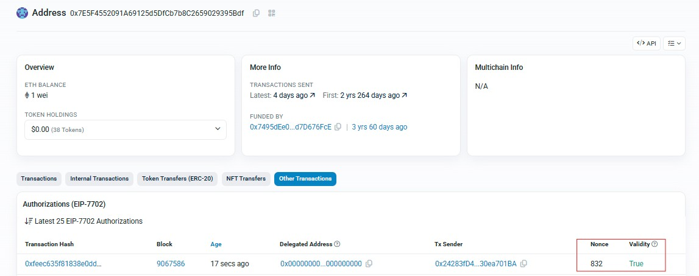

# EIP-7702 Gasless Revoke

This simple script a gasless revoke flow for [EIP-7702](https://eips.ethereum.org/EIPS/eip-7702).  
It allows a sponsor to submit a revoke transaction on behalf of a victim wallet, resetting the delegate to `0x0`.

---

## Installation

You can use either Bun or npm.

### Install Bun
If you do not have Bun installed, you can install it with:
[https://bun.com/](https://bun.com/)
```bash
curl -fsSL https://bun.sh/install | bash
```
Install dependencies
With Bun:
```js
bun install
```
With npm:
```js
npm install
```
Running
Run the revoke script:

```js
bun revoke.ts
```

## Screenshots

### Wallet delegate – showing the current delegate set


### Transaction hash – example of the broadcasted revoke transaction


### Success – delegate successfully reset to 0x0



## Environment Variables

Create a .env file in the root directory with the following values:

```m
VICTIMS=0x0000000000000000000000000000000000000000000000000000000000000001
SPONSOR=0xLOLOLOLOLOLOLOLOLOLOOLOLOLOLOLOLOLOLLOOL
REVOKE_7702_CONTRACT=0x0000000000000000000000000000000000000000
RPC=https://1rpc.io/sepolia
```

VICTIMS → Private key of the victim account (hex string).
SPONSOR → Private key of the sponsor account (hex string).
REVOKE_7702_CONTRACT → Address of the revoke contract.
RPC → RPC endpoint for the target chain (e.g., Sepolia, BNB, Avalanche, Mantle, etc).

## How It Works
Victim signs an authorization message delegating revoke rights.
Sponsor signs its own authorization.
Sponsor submits a transaction with both signatures.
Contract processes the revoke and resets the delegate.


## Uses viem
- for RPC and transaction handling.
- Fully compatible with Bun and npm.

## Tech Stack
- Viem
- TypeScript
- Bun / Node.js